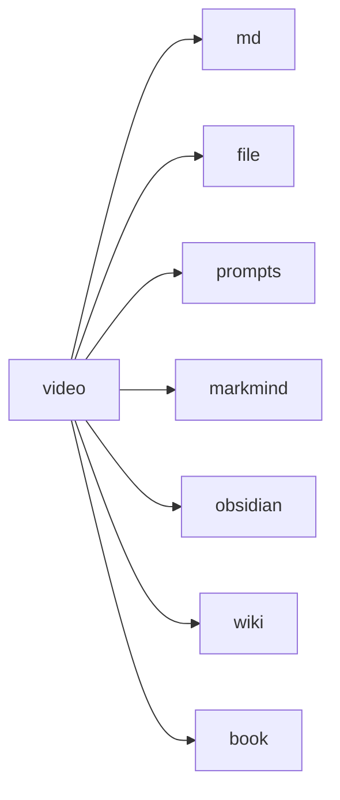

## markdown_processor

```mermaid
graph LR
Node1["video"]
Node2["md"]
Node3["file"]
Node4["UI"]
Node4["prompts"]
Node5["markmind"]
Node6["obsidian"]
Node7["wiki"]
Node8["book"]
Node1-->Node2
Node1-->Node3
Node1-->Node4
Node1-->Node5
Node1-->Node6
Node1-->Node7
Node1-->Node8

```
## video
利用字幕生成总结视频内容,根据视频内容时间戳分段视频