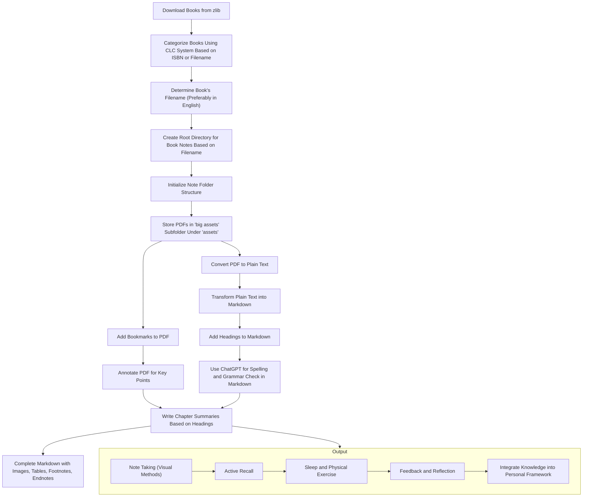
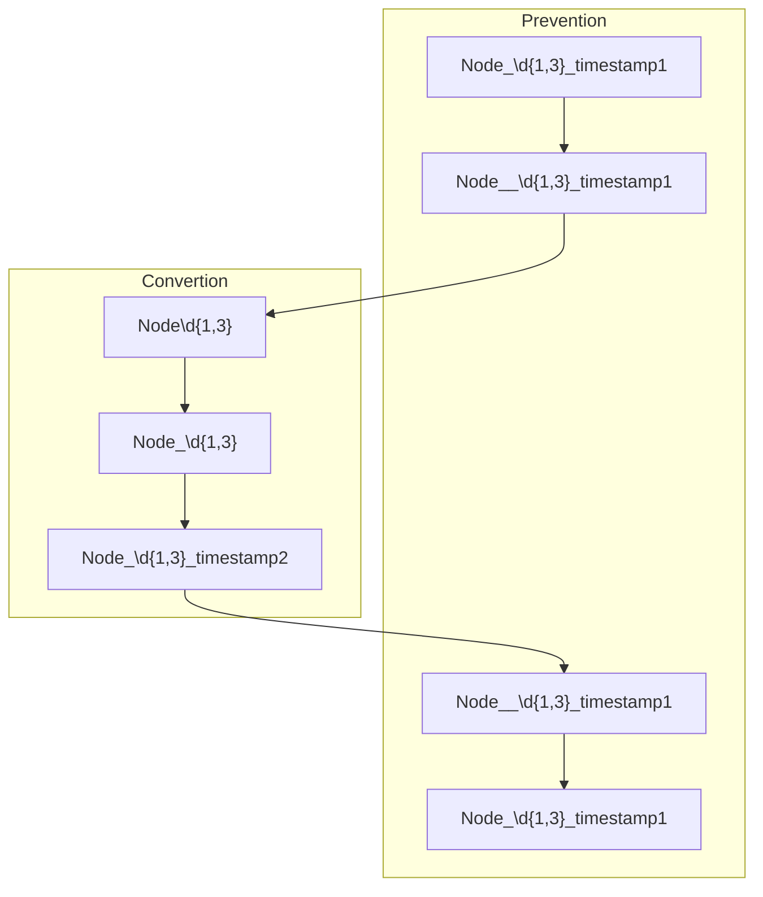

## markdown_processor

## 需求1
格式化 字幕,代码等,方便输入chatgpt. 生成相关总结内容.

## 需求2--视频分段笔记
然后根据总结的时间戳生成拆分的视频笔记

## Book Workflow
- Download books from zlib.
- Categorize books using the CLC classification system based on their ISBN or filename.
- Determine the book's filename, preferably in English.
- Create a root directory for book notes based on the book's filename.
- Initialize the note folder structure.
- Store PDF files under the 'big assets' subfolder within the 'assets' folder.
- Add bookmarks to the PDF.
- Annotate the PDF to emphasize key points.
- Convert the PDF into plain text.
- Transform the plain text into markdown.
- Add headings to the markdown.
- Use ChatGPT to check spelling and grammar in the markdown.
- Write summaries for each chapter following the heading structure.
- Complete the markdown with images, tables, footnotes, endnotes, etc.
- Integrate the key points into your personal knowledge system.

## mermaid Workflow

- Change Node_\d{1,3}_timestamp1 to Node__\d{1,3}_timestamp1.
  - This step to prevent the modification of already standardized node names:
- Change Node\d{1,3} to Node_\d{1,3}.
- Change Node_\d{1,3} to Node_\d{1,3}_timestamp2.
- Change Node__\d{1,3}_timestamp1 to Node_\d{1,3}_timestamp1.

