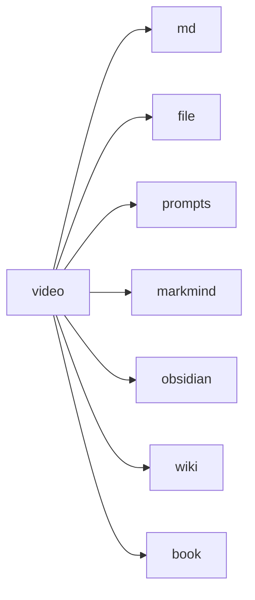

## markdown_processor

```mermaid
graph LR
Node1["video"]
Node2["md"]
Node3["file"]
Node4["UI"]
Node4["prompts"]
Node5["markmind"]
Node6["obsidian"]
Node7["wiki"]
Node8["book"]
Node1-->Node2
Node1-->Node3
Node1-->Node4
Node1-->Node5
Node1-->Node6
Node1-->Node7
Node1-->Node8

```

```mermaid
classDiagram
    class EbookProcessingTasks {
        +renameMarkdownFiles()
        +adjustMarkdownHeaderLevels()
        +prependFilenameAsChapterHeader()
    }
    class FileOperations {
        +backupDirectory()
        +renameFilesInDirectory()
        +performRegexOnFiles()
    }
    class FlagManager {
        +setFlag()
        +getFlag()
        +toggleFlag()
    }
    class HtmlToMarkdownConverter {
        +convertHtmlFiles()
        +changeHtmlTitles()
    }
    class main {
        +executeMainFunctions()
    }
    class MarkdownCreator {
        +createMarkdownFilesFromPDF()
    }
    class MarkdownHelpers {
        +formatTextForMarkdown()
        +upgradeMarkdownHeadings()
    }
    class PromptGenerator {
        +generatePromptsForChatGPT()
    }
    class ApplicationUI {
        +createUserInterface()
    }
    class VideoNoteProcessor {
        +processVideoSubtitles()
        +createVideoNotes()
    }

```
## video
利用字幕生成总结视频内容,根据视频内容时间戳分段视频