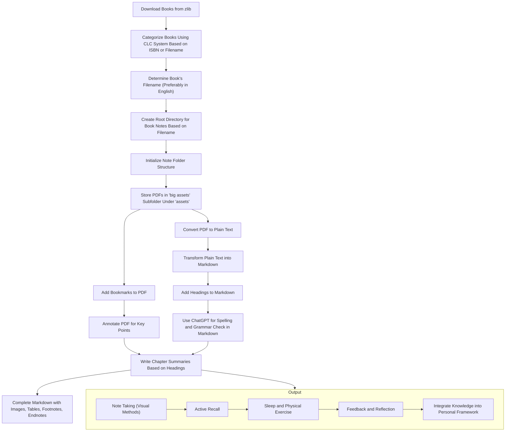

## markdown_processor

## 需求1
格式化 字幕,代码等,方便输入chatgpt. 生成相关总结内容.

## 需求2--视频分段笔记
然后根据总结的时间戳生成拆分的视频笔记

## book 工作流
从 zlib下载书籍
根据书籍ISBN或者文件名,纳入CLC分类系统
确定书籍文件名,最好用英文名
根据书籍的文件名,创建书籍笔记的根目录
并初始化笔记文件夹结构
pdf文件放到assets文件夹的下的big assets文件夹下
对pdf进行添加书签,对内容分段
annotate pdf 进行内容key points 标注
将pdf转成plain text
将plain text 转成 markdown
为markdown添加head标题
并用chatgpt校对单词拼写和语法
根据head结构编写每个章节的总结
为markdown补全图片及表格,脚注,endnotes等
将key points 纳入到自己的知识体系中

## Book Workflow
- Download books from zlib.
- Categorize books using the CLC classification system based on their ISBN or filename.
- Determine the book's filename, preferably in English.
- Create a root directory for book notes based on the book's filename.
- Initialize the note folder structure.
- Store PDF files under the 'big assets' subfolder within the 'assets' folder.
- Add bookmarks to the PDF.
- Annotate the PDF to emphasize key points.
- Convert the PDF into plain text.
- Transform the plain text into markdown.
- Add headings to the markdown.
- Use ChatGPT to check spelling and grammar in the markdown.
- Write summaries for each chapter following the heading structure.
- Complete the markdown with images, tables, footnotes, endnotes, etc.
- Integrate the key points into your personal knowledge system.

